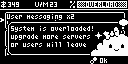
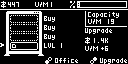
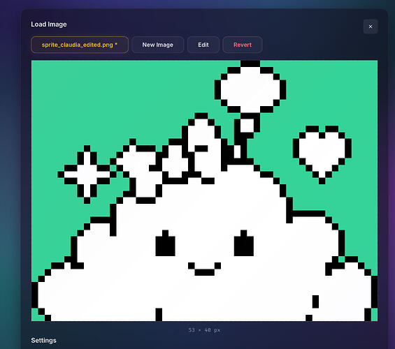
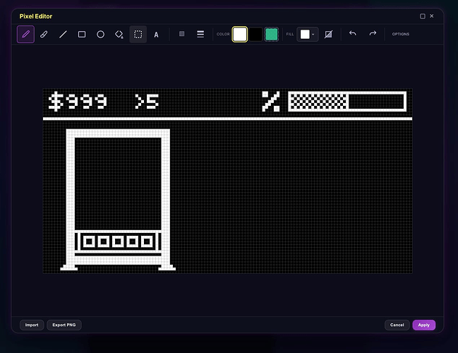
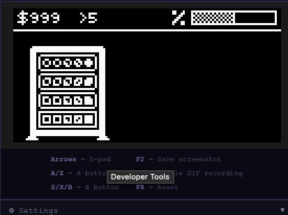
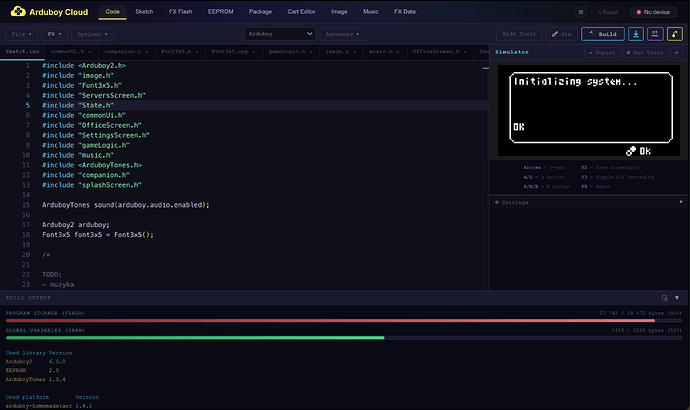
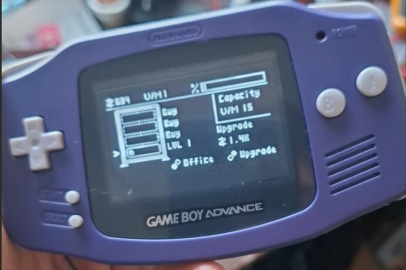

This is my first ever Arduboy game — and only my third game overall 😄

[Play the game in browser](https://devchew.github.io/Claudia-arduboy-game/)

# Cloudia

**Cloudia** is an idle/management game where your goal is to build and scale a growing cloud infrastructure. Buy servers, expand your datacenter, unlock upgrades, and attract more users while keeping up with increasing demand.

Starting from a tiny setup, you’ll gradually transform your operation into a powerful digital empire. Efficient upgrades and smart expansion are the key to success.

## Features

* Idle / incremental gameplay
* Build and upgrade servers
* Expand your rack capacity
* Increase traffic and user growth
* Retro management sim feel
* Designed specifically for Arduboy hardware

## Built in the Cloud

A big part of this project was using the web-based Arduboy tools. Much of the first development stage happened entirely in the browser, which made rapid iteration fast and convenient.

I started with the visual concept and UI layout, experimenting with how the game should look and feel. The sprite editor turned out to be an excellent tool for quick prototyping.

I could quickly move between the sprite editor and hardware testing, building screens, checking readability, and refining the interface directly on the device.

There was even a successful Dual Core test :grinning_face_with_smiling_eyes:

## About AI Assistance

Despite the theme of cloud servers, **Cloudia** was made as a hands-on personal project — but I did use AI tools in practical ways.

As a non-native English speaker, most of the in-game text and this page were proofread, rewritten, or polished with help from **GPT**, so I could avoid awkward phrasing and language mistakes.

AI was also helpful during development when I got stuck debugging difficult issues or couldn’t identify the source of a bug. It didn’t build the game for me, but it definitely helped me finish it more smoothly.

## Problems with the Cloud Editor

The biggest issue for me was project file management and persistence of changes. Constantly saving versions and ending up with a large collection of ZIP files quickly became messy. Near the end of development, my solution was to use the sync feature: edit the project in **VS Code**, then sync it back to the browser for building. That also gave me proper **Git** version control, branching, and backups.

Another challenge was audio. Since I’m not a musician, the game still has no real soundtrack or sound effects. I experimented with importing MIDI music, but removed it because of limited cartridge space and the results were not good enough.

One minor frustration with the image editor is that after importing artwork and converting it to a `.h` file, you can still edit the image, but resizing options are limited.

Aside from those points, I think the Cloud Editor is a great tool, especially for beginners. You can open it in a browser and have a game running very quickly. The time from idea to first playable prototype is impressively short.

If the editor eventually adds features often mentioned by the community — such as better file management UI, built-in Git integration, and integrated documentation — using external tools like VS Code would become far less necessary.

## Thanks for playing!

Cloudia was a really fun project to build, and a great opportunity to create something small, focused, and polished for Arduboy.
Maybe one day i'll learn how to create music and add the missing feature.
